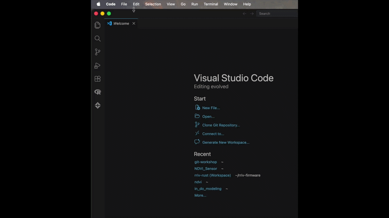

# Using git and VS Code
VS Code has git support built in. If you have git properly installed, VS Code will automatically detect that when you open a directory/folder.

VS Code is designed to be used with git, so you can open entire directory with VS Code and the git version tracking will automatically appear. These folders are managed as discrete projects.

You can navigate to the icon that looks like git branches to see the git functions.

