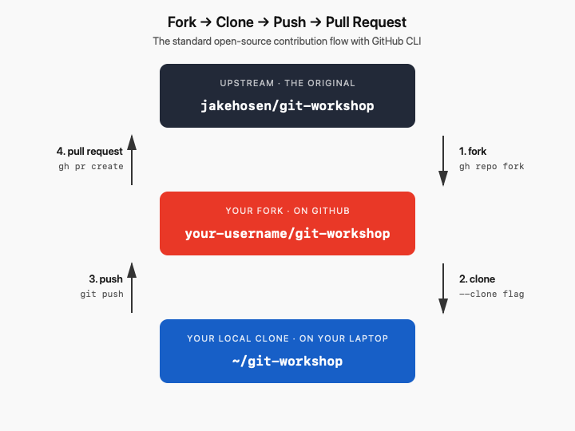

# Collaborating with Git

A lot of the time if you are working on a bigger project you will want to fork the repository, make the required changes, and then request that these be merged with a *pull request*.<br><br>
A pull request is an unintuitive term (in my opinion). If you make a pull request, you are asking the maintainer of a repository to pull changes you have made to that repository. So from your perspective, it is more like a push than a pull.




# Here's how you do this:

## 1. Fork the repository

From any directory, run:

```bash
gh repo fork jakehosen/git-workshop --clone
```

Two things happen at once:

- `gh` creates a fork on your GitHub account (it'll be at `your-username/git-workshop`).
- It clones that fork to your current directory.

You'll also be asked whether to add the original repo as an **upstream** remote — say **yes**. That gives you a way to pull in updates from the original later.

Move into the folder:

```bash
cd git-workshop
```

---

## 2. Create a branch for your changes

Don't work directly on `main`. Make a branch:

```bash
git switch -c my-edits
```

Name it something descriptive — `fix-typo-in-readme`, `add-example-script`, etc.

---

## 3. Make changes, commit, push

Edit the files, then stage and commit:

```bash
git add .
git commit -m "Short description of what you changed"
```

Push the branch to your fork:

```bash
git push -u origin my-edits
```

The `-u` sets up tracking so future `git push`es on this branch don't need extra arguments.

---

## 4. Open the pull request

Still in the project directory, run:

```bash
gh pr create
```

You'll be prompted for:

- **Title** — short summary of the change.
- **Body** — what you did and why. Be specific; the maintainer will read this.
- **Base repository** — confirm this is `jakehosen/git-workshop` (the original).
- **Base branch** — usually `main` on the upstream.

When you confirm, `gh` opens the PR on GitHub and prints the URL.

### Shortcut: one-liner

If you already know what you want to say:

```bash
gh pr create --title "Fix typo in README" --body "Caught a typo in the introduction section."
```

To open the PR page in your browser right after:

```bash
gh pr view --web
```


# Pair Exercise: Forks, Pull Requests, and Merge Conflicts

In this exercise, you and a partner will simulate a real-world situation where two people edit the same file in the same project at the same time. One of you owns the repo; the other forks it and contributes back. **Both of you edit the same line and you have to fix it.**

By the end you'll have walked through the entire fork-and-PR workflow *and* resolved a real merge conflict.

---

## Roles

Pair up. Decide who plays which role:

- $\color{yellowgreen}{\textsf{\textbf{Maintainer:}}}$ creates the repo, owns `main`, will merge the PR at the end.
- $\color{blue}{\textsf{\textbf{Contributor:}}}$ forks the repo, makes a change, opens the pull request.

You can switch roles and repeat if there's time.


## $\color{yellowgreen}{\textsf{\textbf{Part 1 — Maintainer: create the repo}}}$


1. From any directory, create a new local repo:

   ```bash
   mkdir conflict-demo
   cd conflict-demo
   git init
   ```

2. Create a simple README:

   ```bash
   echo "# Conflict Demo" > README.md
   echo "" >> README.md
   echo "Favorite color: TBD" >> README.md
   ```

3. Commit it:

   ```bash
   git add README.md
   git commit -m "Initial commit"
   ```

4. Create the repo on GitHub and push using GitHub CLI:

   ```bash
   gh repo create conflict-demo --public --source=. --push
   ```

5. Tell your partner the repo path — `your-username/conflict-demo`. You can also open it in the browser to confirm it's live:

   ```bash
   gh repo view --web
   ```


## Part 2 — Contributor: fork, clone, and prepare a change

Get the repository address as described above

1. Fork and clone in one step:

   ```bash
   gh repo fork maintainer-username/conflict-demo --clone
   cd conflict-demo
   ```

   When asked about adding an upstream remote, say **yes**.

2. Make a branch for your change:

   ```bash
   git switch -c pick-a-branch-name
   ```

3. Open `README.md` and change the line:

   ```
   Favorite color: TBD
   ```

   to your actual favorite color, for example:

   ```
   Favorite color: cerulean
   ```

4. Commit and push your branch:

   ```bash
   git add README.md
   git commit -m "Set favorite color to cerulean"
   git push -u origin my-favorite-color
   ```
## Part 3 — Maintainer: make a conflicting change

While your contributor was working, you also had opinions about color. You're going to change the **same line** to something different.

1. Make sure you're on `main`:

   ```bash
   git switch main
   ```

2. Edit `README.md` and change the same line to **your** favorite color (different from your partner's):

   ```
   Favorite color: mauve
   ```

3. Commit and push directly to `main`:

   ```bash
   git add README.md
   git commit -m "Set favorite color to chartreuse"
   git push
   ```

Now `main` on GitHub has *your* version of that line. The Contributor's fork still has *their* version on the branch.

> **Checkpoint.** Tell your partner to open the PR now.

---

## Part 4 — Contributor: open the pull request


From inside the project folder, open the PR:

```bash
gh pr create --title "Set favorite color" --body "Adding my favorite color."
```

Confirm the base is the upstream `main`. Then open the PR in the browser:

```bash
gh pr view --web
```

You should see a yellow or red banner that says something like:

> **This branch has conflicts that must be resolved**

Both branches changed the same line so Git can't automatically merge. You have to decide how to resolve this.

---

## Part 5 — Resolve the conflict together

There are a couple of ways to resolve a PR conflict.

### As the contributor
1. Pull the latest `main` from upstream into your PR branch:

   ```bash
   git fetch upstream
   git merge upstream/main
   ```

   (If `gh` didn't add the upstream remote earlier, add it now with `git remote add upstream git@github.com:maintainer-username/conflict-demo.git` and re-run the fetch.)

2. Git will tell you about the conflict:

   ```
   CONFLICT (content): Merge conflict in README.md
   Automatic merge failed; fix conflicts and then commit the result.
   ```

3. Open `README.md`. You'll see the conflict markers:

   ```
   <<<<<<< HEAD
   Favorite color: cerulean
   =======
   Favorite color: chartreuse
   >>>>>>> upstream/main
   ```

   - The top section is **your** version (the Contributor's branch).
   - The bottom section is the **Maintainer's** version (from upstream `main`).

4. **Talk to your partner.** Decide together how to resolve:
   - Keep one color and discard the other?
   - Combine them: `Favorite color: cerulean and chartreuse`?
   - List both on separate lines?

   Edit the file to reflect the decision, and remove all the `<<<<<<<`, `=======`, and `>>>>>>>` markers.

5. Stage and commit the resolution:

   ```bash
   git add README.md
   git commit
   ```

   Git will pre-fill a merge commit message. Save and close it.

6. Push the fix to your PR branch:

   ```bash
   git push
   ```

7. Refresh the PR page in your browser. The conflict banner should be gone, and the PR should now say it can be merged.


## Part 6 — Maintainer: merge the PR


1. Review the change on the PR page.
2. Click **Merge pull request**, then **Confirm merge**.

   Or from the command line:

   ```bash
   gh pr merge --merge
   ```

The Contributor's resolved change is now on `main`. 

