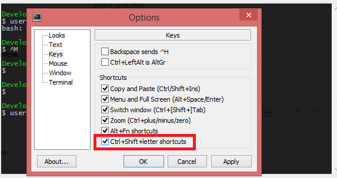

<link rel="shortcut icon" type="image/x-icon" href="images/favicon.ico">

# Things to do before the workshop

## Using Terminals
A local terminal with git installed is required to fully access the features available from Git and GitHub. For macOS and Linux, the built-in terminal will work. For Windows, you can use Windows Powershell. There is also a terminal program called *gitbash* that is installed when you install Git that has similar functionality. There are also many other good terminal options out there to fit the many preferences that different programmers have.<br><br>
Pick a terminal to use and make sure that git and related software are installed and working on your chosen terminal. If you need a crash course in terminal basics, check out the [Mozilla Command Line Crash Course](https://developer.mozilla.org/en-US/docs/Learn_web_development/Getting_started/Environment_setup/Command_line).<br><br>

### Note about shortcuts
For Linux and Windows users, terminal clients have a conflict with common shortcuts. The most significant of these is the fact that ```ctrl+c``` in the terminal kills (cancels) whatever program/process is running. This is an issue because ```ctrl+c``` is also the most commonly used copy shortcut. There are two solutions to this:
  1. All the traditional shortcuts have shift added. So to copy you change ```ctrl+c``` to ```ctrl+shift+c```.
  2. Use a different set of shortcuts. For example, copy is ```shift+insert```. This is the default setting for a lot of windows terminal software.
If you prefer the ```shift``` method, you can go into options for programs like Git Bash and select ```ctrl+shift+letter shortcuts``` as indicated in the graphic below.
<br>

### Note for Windows Powershell users.
I recommend installing Vim and Nano, two common text editors in Windows Powershell. You can do this with the following commands:
```
winget install vim.vim
winget install GNU.Nano
```


### Vim text editor
If you are not familiar with vim, the most commonly used terminal text editor, I recommend checking out [this brief primer](vim-intro.md).

## Software to install
* [Git](https://git-scm.com/install/)
* [GitHub CLI](https://cli.github.com/): This is a set of commands that automate common git functions, but only work for GitHub, not other git repositories.
  * If you are using Windows and do not have administrator access, use the following command to install for one user without an admin password: ```winget install --id GitHub.cli --scope user```.
* [Visual Studio Code](http://code.visualstudio.com) (not to be confused with Visual Studio).
* [RStudio](https://posit.co/download/rstudio-desktop)
* *Optional:* Install GitHub Desktop GUI. Features are limited compared to the command line and so we will not directly use this in our workshop, but can provide useful visualization of commits.

## Configuring your terminal for Git
The easiest way to access GitHub repositories from the terminal is via SSH. This requires setting up a new SSH key and uploaded the public version of this key to Github
* Setup a new SSH key using the [operating system-specific instructions found here](https://docs.github.com/en/authentication/connecting-to-github-with-ssh/generating-a-new-ssh-key-and-adding-it-to-the-ssh-agent).
* Add the SSH Key to your [GitHub Account](https://docs.github.com/en/authentication/connecting-to-github-with-ssh/adding-a-new-ssh-key-to-your-github-account).

## Watch this video
Check out these two videos. The first is a very brief description of Git and its basic functionality. The second is a talk from a recent open source software conference describing a particular philosphy for programming with Git. I think you'll be able to understand the major points of the second video before the workshop, but you may want to revisit this video after you've gotten some hands-on experience with Git.
* [Basic 100 second intro to Git](https://www.youtube.com/watch?v=hwP7WQkmECE&t=9s)
* [Atomic flow coding presentation](https://youtu.be/tu9mtQXM-7Y?si=QLVbhUrYttgIW1M8)
