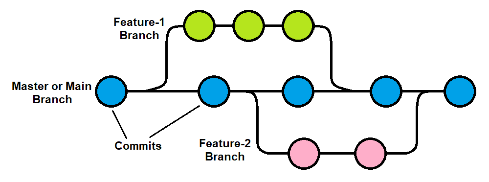

# Git Basics
## Creating and Cloning Repositories
* There are two ways to get a repository on your computer to start your work:
    1. Create a new repository.
    2. Clone someone else's repository (or one that you've created previously).

## Cloning a respository
Now we're going to clone the repository with these documents onto your local computer. [On the repository's GitHub page](https://github.com/jakehosen/git-workshop/tree/main), click the green **Code** button, switch the tab to **SSH**, and copy the URL. It'll look like:

```
git@github.com:username/repo-name.git
```

Then, in the directory where you want the repo to live:

```bash
git clone git@github.com:username/repo-name.git
```

You'll get a new folder named after the repository, with the full history downloaded.

To clone into a specific folder name instead, pass it as an extra argument:

```bash
git clone git@github.com:username/repo-name.git my-folder-name
```

## Creating a new repository
### Here you are going to make a brand new repository that is owned by you. Make sure you do not put it in a subfolder of the git-workshop or any other repository.
* Go to [GitHub.com](http://github.com) and click the button labeled ```New``` on the top left of your screen.
[Graphic showing 'new' button on the top left corner of the GitHub website](image/new-repository.png).
* On the next page, fill in the name of your new repository and a description. Keep the repository visible. You can add a readme on this screen or you can add it as part of the next step.
* Once you're done, click the ```Create Repository``` button.
* Now go to the command line to create the repository locally.
* You want to navigate the terminal so that you are in the directory into which you want to put your new repository. You can use the ```cd``` comand to get into the right place and then you can make a new directory for the git workshop materials as follows: ```mkdir git-workshop```. Then type ```cd git-workshop```. That will put you in the folder for cloning your directory.
    * You want to save your repository in your home directory, ```Documents```, ```Desktop```, or similar. Don't use the root directory (```c:/``` or ```/```) and don't use system folders like ```c:/windows```.
* Using the following commands (copy and paste from the GitHub the version specific to your repository)
```
echo "# example" >> README.md
git init
git add README.md
git commit -m "first commit"
git branch -M main
git remote add origin git@github.com:jakehosen/example.git
git push -u origin main
```
* **Note**: Before entering the commands above, make sure that you have created a folder with the name of the repository and then navigated in the terminal into that folder.

## Using .gitignore
**.gitignore**: This is a file that tells Git what files should be excluded even when running a command to stage all files (```git add .```). This is essential for macOS users. In each folder, macOS will put a hidden file called ```.DS_Store```. If you don't add it to your .gitignore, all your directories will have this file listed. It gets annoying.


# Creating a New Commit from the Command Line

## To follow along, add a file called example.r with some basic R code (just one line is enough) to the new repository you've created.

A commit is a saved snapshot of your project at a moment in time. Making one is a three-step rhythm: **check what changed**, **stage what you want to save**, **commit it with a message**.

```bash
git status
```

You'll get output that looks something like:

```
On branch main
Changes not staged for commit:
  modified:   analysis.R
  modified:   README.md

Untracked files:
  notes.txt
```

Three categories to recognize:

- **Modified** — tracked files that have changed since the last commit.
- **Untracked** — new files git has never seen before.
- **Staged** — changes you've already marked for the next commit (none yet).

If you want to see the actual line-by-line changes (not just which files changed):

```bash
git diff
```


## Stage and push changes in a commit
Staging is how you tell git *which* changes belong in this commit. You don't have to commit everything at once — you can group related changes together and leave others for later.

**Make some small changes to your file and then follow the instructions below**

**Stage a single file:**
Maybe you just want to track the one file you just added. You can do that as follows:

```bash
git add example.r
```

**Stage more than one specific file:**

```bash
git add example.r README.md
```

**Stage everything that's changed or new (most common approach):**

```bash
git add .
```

The `.` means "everything in the current directory and below." Use it when you genuinely want all changes; otherwise, name files explicitly so you don't accidentally commit something like a half-written scratch file.

Run `git status` again to confirm — staged files will appear in green under "Changes to be committed."

## Commit with a message

Now commit the selected files to a snapshot:

```bash
git commit -m "Add LOESS smoothing to baseline correction"
```

The `-m` flag lets you write the message inline. If you leave it off, git opens your default editor so you can write a longer message — useful when one line isn't enough.

## Push your changes
Presuming you are connected to the internet, you can now push your changes using ```git push```. You can stage more than one commit before using ```git push```.

# Try pushing a commit yourself
Add or change a file inside the new repository you created and then following the instructions to use ```git add```, ```git commit```, and ```git push``` to stage and push your commit.


# Branches
A key feature of Git is the ability to create and then subsequently merge branches. This allows you to test new things and allows different people to develop and debug code features independently.


## See which branch you're on

Start by checking where you are:

```bash
git branch
```

You'll see a list of branches, with an asterisk next to your current one:

```
* main
```

If you've never made a branch before, that's the only one you'll see.


## Create a new branch

Make a new branch with a descriptive name:

```bash
git branch try-new-algorithm
```

Run `git branch` again and you'll see both:

```
* main
  try-new-algorithm
```

Notice the asterisk is still on `main`. **Creating a branch doesn't switch to it.** It just makes the branch exist.

### Naming branches

Use short, descriptive names. A few conventions you'll see:

- `feature/add-export-button`
- `fix/typo-in-readme`
- `experiment/new-smoothing-method`

Slashes are allowed and help group related branches. Spaces are not — use hyphens or underscores instead.


## Switch to a branch

To move onto your new branch:

```bash
git switch try-new-algorithm
```

Run `git branch` once more:

```
  main
* try-new-algorithm
```

The asterisk has moved. You're now working on `try-new-algorithm`. Any commits you make from here will land on this branch, not on `main`.

> **Shortcut:** You can create and switch in one step with `git switch -c try-new-algorithm`. The `-c` stands for "create."

> **Older command:** You may see tutorials use `git checkout` instead of `git switch`. Both work, but `git switch` is newer and clearer. `checkout` does a lot of other things too, which is why `switch` was introduced.

---

## Work on the branch

Make changes, stage them, and commit as usual:

```bash
git add .
git commit -m "Try LOESS smoothing instead of moving average"
```

This commit lives **only** on the `try-new-algorithm` branch. If you switch back to `main`, you won't see it.

To prove it to yourself:

```bash
git switch main
```

Your files on disk will revert to whatever `main` looks like — your new changes seem to vanish. They haven't; they're safely sitting on the other branch. Switch back:

```bash
git switch try-new-algorithm
```

And your changes reappear. Git is swapping the contents of your folder as you move between branches.

---

## Merge the branch back in

If your experiment worked and you want the changes on `main`, merge them in.

First, switch to the branch you want to merge **into**:

```bash
git switch main
```

Then merge the other branch **into** the current one:

```bash
git merge try-new-algorithm
```

If there are no conflicts, git applies the commits from `try-new-algorithm` onto `main` and you're done.

---

## Handle a merge conflict (if one happens)

A conflict happens when the same lines of a file changed on both branches and git can't tell which version to keep. You'll see something like:

```
CONFLICT (content): Merge conflict in analysis.R
Automatic merge failed; fix conflicts and then commit the result.
```

Open the conflicting file. Git marks the conflicting region like this:

```
<<<<<<< HEAD
result <- mean(values)
=======
result <- median(values)
>>>>>>> try-new-algorithm
```

The top section (between `<<<<<<<` and `=======`) is what's on your current branch. The bottom section (between `=======` and `>>>>>>>`) is what's coming in from the other branch.

Edit the file to keep what you actually want — delete the markers and either version's lines, leaving the final result. Then:

```bash
git add analysis.R
git commit
```

Git will pre-fill a commit message for you. Save and close.


## Key commands

**List all branches, including ones on the remote:**

```bash
git branch -a
```

**See branches with their most recent commit:**

```bash
git branch -v
```

**Rename the branch you're currently on:**

```bash
git branch -m new-name
```

**Remove changes you started but don't want to keep** (before committing):

```bash
git restore .
```

This reverts unstaged changes in your working folder. Useful when an experiment isn't going anywhere and you want a clean slate to switch branches.

**Temporarily save uncommitted changes that you have made locally**
```bash
git stash
```
This could be used if you want to switch branches, but you have changes on the current branch that you are not ready to put into a commit.


# Example: Rewind to a previous commit and make a new branch.
Sometimes you want to go back to an earlier point in your project and try a different direction from there without losing the commits that came after. The safest way to do this is to leave your `main` branch alone and start a **new branch** from an earlier commit.

!(Conceptual diagram depicting moving to a previous commit and creating a new branch in Git)[images/branch-from-earlier-commit.png]

## Step 1: Find the commit you want to go back to

List your recent commits with their hashes:

```bash
git log --oneline
```

You'll see something like:

```
a3f9c2d (HEAD -> main) Refactor analysis loop
b7d1e44 Add second smoothing pass
2e8a91f Add LOESS baseline correction
9c4f6b1 Initial commit
```

The short string on the left of each line (e.g. `2e8a91f`) is the commit hash. Pick the one you want to branch from and copy it.

---

## Step 2: Create a new branch from that commit

In a single command:

```bash
git switch -c new-direction 2e8a91f
```

- `new-direction` is the name of your new branch — call it whatever fits.
- `2e8a91f` is the commit hash you chose.

That's it. You're now on a fresh branch that starts at that earlier commit.

---

## Step 3: Confirm where you are

Run:

```bash
git log --oneline
```

You'll see the history up to your chosen commit, but **not** the commits that came after on `main`. Those still exist — they're just on `main`, not here.

---
