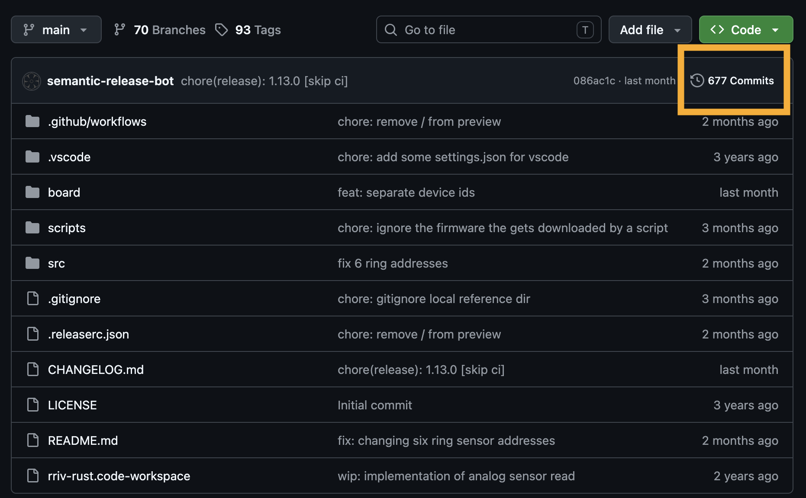
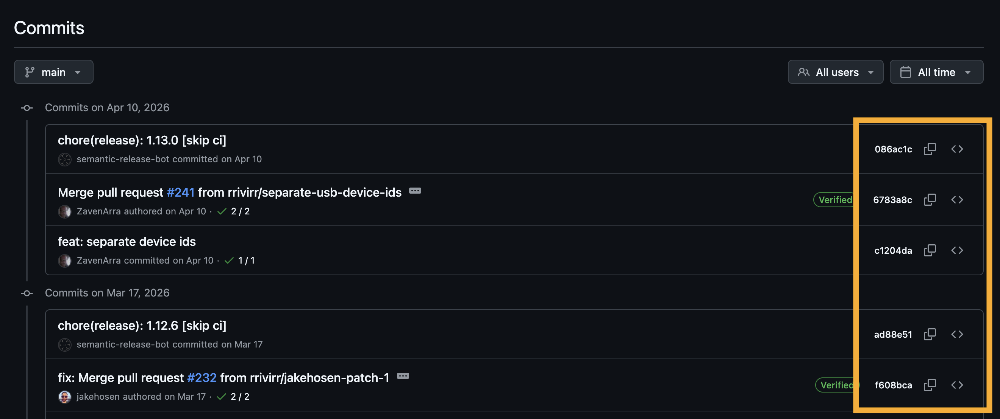

# Some notes on Git
{: .no_toc }

<details open markdown="block">
  <summary>
    Contents
  </summary>
  {: .text-delta }
- TOC
{:toc}
</details>

A lot of Git commands are redundant or semi-redundant. That means that there can be more than one correct way to do things. This happens in large part because Git is evolving and new commands that are more convenient have been added. A lot of the original Git commands do many different things, so individual functions were made to simplify some processes

## Creating a new branch
Creating a new branch can be confusing, because there are many ways to do this.

### Create a branch but don't switch to that branch
{: .no_toc }

You can create a new branch without switching to it that branches from whatever commit you're on at the time.
```
git branch <name>
```

Or you can use this slightly different command to point to a particular commit or branch
```
git branch <name> <start-point>
```

### Create a branch and switch to that branch
{: .no_toc }

The commands for creating a branch and switching to the branch are similar:

```
git checkout -b <name>
git checkout -b <name> <start-point>
```

But to make things a little confusing, you can use a similar command to create and switch to a branch with

```
git switch -c <name>
```

## Switching between branches

Switch to a specific branch. Note: either command is correct, but the current recommendation is to use ```git switch``` because ```git checkout``` can also restore files, which can lead to problems.

```
git switch <branch>
git checkout <branch>
```


## Restoring specific files from previous commits
Rather than rolling back all your files to a specific commit, in many cases you will want to restore a single file from a previous commit.

You will need the hash (a specific identifier) for the commit of interest. To find that click on the commits link on the main page of the repository on which you are working.



Once you are on the commits page, you can look for your commit and record the hash. There is a copy paste button (the icon with two rectangles) that you can use to copy the has for your commit of interest. Note: the commit hashes are actually much longer than seven characters, but you only need these last seven characters to switch between commits.



Now that you know the commit, you have two different commands to choose from. 

```
git checkout <commit-hash> -- path/to/file
```
More recently, git has added a command called ```git restore```, which separates out the restore function from ```git checkout``` in much the same way that ```git switch``` separates out the branch-switching function.

```
git restore --source=<commit-hash> path/to/file
```

You can also restore a single file from another branch:
```
git restore --source=<branch-name> path/to/file
```

## Is the primary git branch main or master?
From its inception, git has used the term ```master``` to refer to the primary/original branch within a git repository. As a field, computer scientists are trying to move away from loaded terms like master. Thus, git will soon be transitioning to using the term ```main``` as the default primary branch.

What makes this confusing is that github has already made that change, but they have done it by adding extra lines to commands. Specifically, you will notice that github adds the following command, which renames your primary branch from ```master``` to ```main```.

```
git branch -M main
```

