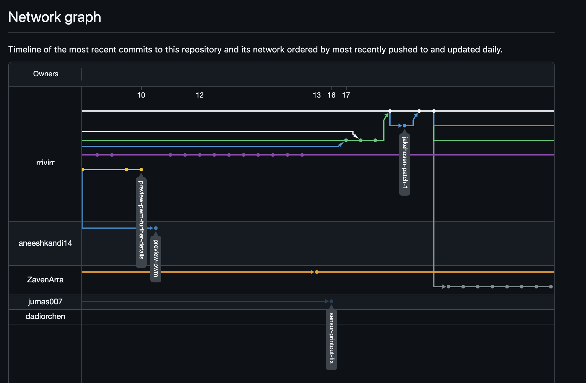
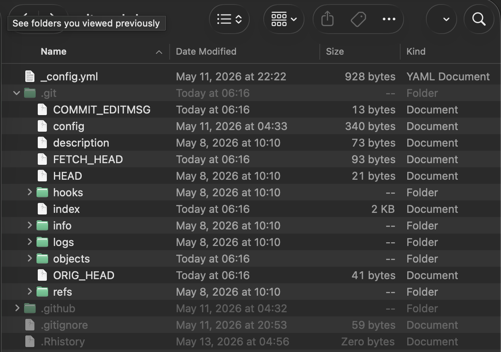
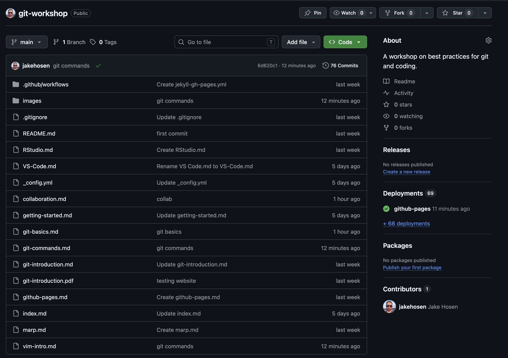
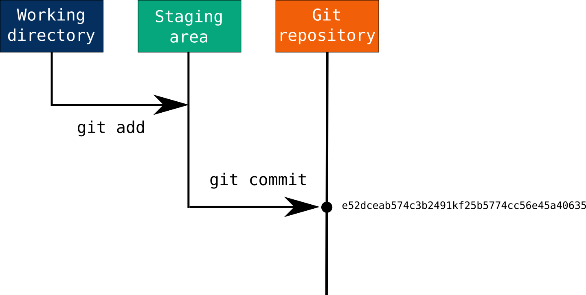
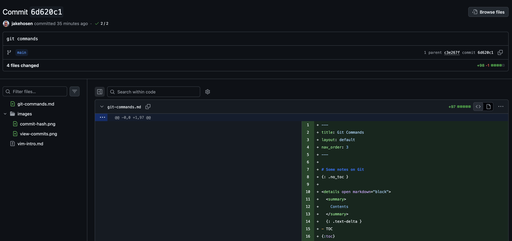

<!-- _class: lead -->
<!-- _paginate: false -->
<!-- _header: '' -->

# Why Use Git?

<style>
.columns {
  display: grid;
  grid-template-columns: 2fr 3fr;
  gap: 1.5rem;
  align-items: start;
}
.columns img {
  width: 75%;
  height: auto;
  display: block;
  margin: 0 auto;
}
</style>

## Track your work and collaborate efficiently

<div class="columns">
<div>

- Take snapshots, known as commits, of your work to track progress and easily rewind.
- Avoid file fragmentation.
- Collaborate efficiently.

</div>
<div>

```
analysis.R
analysis_v2.R
analysis_final.R
analysis_final_FINAL.R
analysis_final_FINAL_use_this_one.R
```



</div>
</div>


---

# Git and GitHub
- Git is the software, GitHub, now run by Microsoft, is one of many services for hosting online git repositories.
- Other Git hosts:
  - [Bit Bucket](http://www.bitbucket.org)
  - [GitLab](http://www.gitlab.com)


---


# Git Fundamentals
- Repository: A folder where Git tracks your project and its history.
- Branch: Different version of the code connected by a tree
- Fork: Make a new copy of a repository on your own computer.
- Clone: Make a copy of a remote repository on your computer.
- Stage: Tell Git which changes you want to save next.
- Commit: Save a snapshot of your staged changes.
- Merge: Combine changes from different branches.
- Pull: Get the latest changes from a remote repository.
- Push: Send your changes to a remote repository.


---

<style>
.columns ul {
  font-size: 0.9em;
  line-height: 1.4;
}
.columns {
  display: grid;
  grid-template-columns: 2fr 3fr;
  gap: 1.5rem;
  align-items: start;
}
.columns img {
  width: 60%;
  height: auto;
  display: block;
  margin: 0 auto;
}
</style>

<div class="columns">
<div>

- Git repositories exist in two places: 1. on your hard drive and 2. on a cloud-based repository service like GitHub
- On your hard drive a git repository exists as a directory/folder with a hidden directory called ```.git``` (in Linux and macOS files begging with '.' are automatically hidden).
- This hidden folder contains the files that tell git what repo you are using. Changes you have staged are also saved here.

</div>
<div>




</div>
</div>

---
### Branches and Forking


---
# Committed with Git



---


# Commit changes



---


<style>
.columns {
  display: grid;
  grid-template-columns: 2fr 3fr;
  gap: 1.5rem;
  align-items: start;
}
.columns img {
  width: 75%;
  height: auto;
  display: block;
  margin: 0 auto;
}
</style>

# Git Workflow

<div class="columns">
<div>


- Basic git workflow for a *commit* is as follows:
    - Select files to be added to a commit with ```git add```.
    - Add those files to the staging area with ```git commit```
    - Send those files to the cloud with ```git push```.
    - Get changes made by others with ```git pull```.
</div>
<div>


</div>
</div>


---
# A few tips
- Read the documents: help files are your friends.
- Try to figure it out: use web search/stack overflow search of errors or other questions you might have before asking another human or AI.
- Undoing a problem created by a bad command is time consuming: always make sure you know what a particulate command or action will do before executing.
- Do all the steps of your instructions **in order**.
- If you can copy and paste commands either by highlighting or better yet with the copy/paste button (the two rectangle icon).
